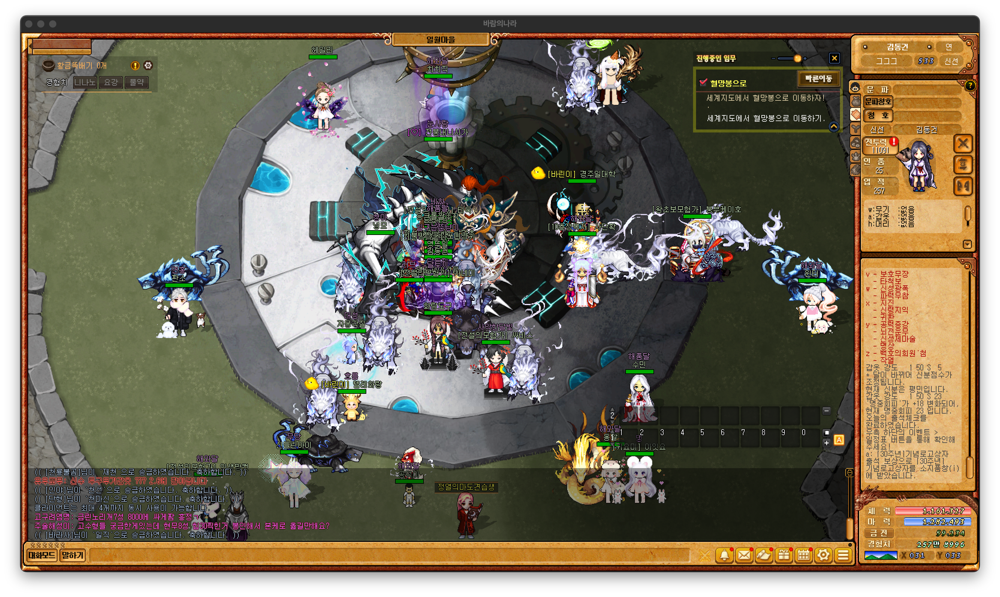
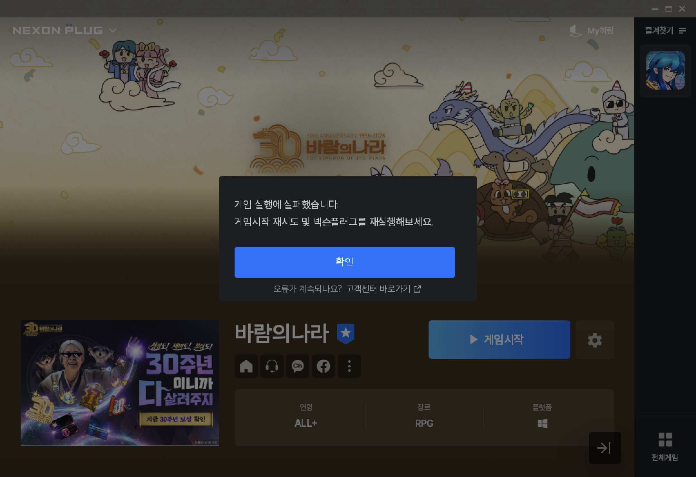

# nx-mac

> **바람의나라 (Kingdom of the Winds) on macOS.** **7.3 seconds** from double-click to login. Zero background processes.

[한국어](./README.md) · [English](./README.en.md)



---

Built on the Sikarugir Wine wrapper (CX 24.0.7). A **builder, AppleScript URL router, and SwiftUI splash** form the launch chain for Nexon's Windows titles. The project doesn't tune Wine itself — it trusts the free upstream stack and focuses on **one verified preset per game**, applied automatically.

The usual macOS path to a Nexon MMO is a hand-assembled wine prefix and dozens of trial-and-error fixes. This project compresses that path into a single run of `build-baram-app.sh`. After that, it's just the `.app` icon in the Dock.

## Key metrics

| Metric | Value |
|---|---|
| Cold-start (click → Plug login window) | **7.3 s** (measured, Apple Silicon) |
| Warm reuse | 2–3 s |
| Idle processes | **0** (full wine tree teardown on exit) |
| Korean IME composition | working |
| GameGuard (NGS) passthrough | verified to in-game |
| Runtime cost | $0 |

## Supported

| Game | Status | Notes |
|---|---|---|
| 바람의나라 | end-to-end verified | v0.1 release target |

Other Nexon titles are untested. See [Compatibility](#compatibility) for predictions.

## How it works

```
double-click
  │
  └─ NX Launcher.app (AppleScript router)
      │
      ├─ NX Splash.app (SwiftUI, reads status file → auto-dismiss)
      └─ shell cmd (cleanup → symlink verify → wine spawn)
          │
          └─ Baram.app (Sikarugir wrapper, WS12WineCX24.0.7)
              │
              └─ NexonPlug.exe (browser-less self-login)
                  │
                  └─ gamer.exe (Kingdom of the Winds)
```

The launcher also registers `nexonplug://` and `ngm://` URL handlers, so the classic browser path (`baram.nexon.com` login → `nxplug://` redirect) converges to the same router.

## Install

**Requirements:** macOS 14+ · Apple Silicon · ~25 GB free disk.

### 1. Create an empty wrapper

```bash
brew tap Sikarugir-App/sikarugir
brew install --cask sikarugir
```

In Sikarugir Creator, click **New Blank Wrapper**:

| Setting | Value |
|---|---|
| Name | `Baram` |
| Engine | `WS12WineCX24.0.7` |
| OS | `Windows 10` |

The engine must be CX 24.0.7 exactly — other versions do not reproduce the Korean IME fix.

### 2. Run the builder

```bash
git clone https://github.com/dgv7/nx-mac
cd nx-mac
./scripts/build-baram-app.sh
```

The builder automates:

- libinotify dylib symlinks (both `wine/lib/` and `SharedSupport/`)
- `dosdevices/c:` absolute-path correction
- winetricks Korean environment (`corefonts → cjkfonts → vcrun2019`)
- NexonPlug installation (smallpatch workaround)
- **Disabling the `Nexon Launcher` Windows service** — the key to the 50 s → 7 s cold-start
- exit-watcher placement
- `NX Launcher.app` creation + `nexonplug://` URL-handler registration
- SwiftUI Splash compile + bundle
- Automatic cold-start measurement

First run spends 10–20 minutes on the `cjkfonts` step.

### 3. Place gulim.ttc

Copy `C:\Windows\Fonts\gulim.ttc` from your own Windows PC to:

```
~/Applications/Sikarugir/Baram.app/Contents/SharedSupport/prefix/drive_c/windows/Fonts/gulim.ttc
```

The font is Microsoft proprietary; intentionally not bundled. Substitutes (Source Han, Nanum) render the game UI off-metric.

### 4. Launch

Double-click `~/Applications/Sikarugir/NX Launcher.app`. The splash appears immediately and auto-dismisses when the Plug login window is detected.

> **Ignore the "게임 실행에 실패했습니다" popup**
>
> After clicking `게임시작` in Plug, the popup below briefly appears — **but the game actually launches normally**. Click `확인` to dismiss it; the OTP prompt or game window comes up right behind.
>
> 
>
> A false alarm from Plug misreading the game process's exit code under Wine. Auto-dismiss is deliberately not implemented — OTP and real service notices use the same dialog style, and silencing all of them risks hiding something the user actually needs to read.

## Design notes

### 50 s → 7 s: where the cold-start really went

Initial measurements put cold-start at 50 seconds. **Phase profiling** across the boot sequence revealed the bottleneck was not Wine — it was a **40-second auto-start timeout on the `Nexon Launcher` Windows service** that Plug invokes on startup. Disabling auto-start and letting Plug spawn the service on demand dropped cold-start to **7.3 seconds**. No feature loss.

### Korean IME: an engine selection problem

Wine 10 with the macOS Mac driver does not forward IME pre-edit events to IMM32, breaking Korean chat input. **Swapping to CX 24.0.7 resolves it.** CX 24 has a different libinotify rpath (needs `SharedSupport/` in addition to the usual `wine/lib/`), so the builder symlinks both.

### Splash UX: no time estimates

Cold-start varies dramatically by machine — ~7 s on M-series, 30 s+ on older Intel. A fixed ETA would be dishonest on either end, so the splash shows none.

- The AppleScript shell writes stage markers to `/tmp/nx-launcher-status` (`cleanup` → `symlink` → `spawn` → `waiting`)
- The SwiftUI splash reads markers and updates only the current-state text (no numbers)
- `CGWindowListCopyWindowInfo` polls for the Plug window and auto-dismisses on detection
- If any stage sticks for more than 15 s, a subtle hint fades in with an ESC-to-cancel reminder

The spinner carries the "alive" signal; the text carries the "current state" signal. The two are never conflated.

### Zero-idle policy

When Plug or `gamer.exe` exits, `baram-exit-watcher.sh` tears down the entire wine tree. No background residents; every launch is a cold start. Deliberate — persistent processes clash with macOS's explicit open/close mental model and can confuse Nexon's session tracking.

### Why the router is a `.app`

macOS LaunchServices only binds URL schemes like `nexonplug://` and `ngm://` to `.app` bundles — a plain CLI binary cannot intercept them. The router is an AppleScript applet because `osacompile` builds the bundle without requiring a Swift toolchain, keeping the URL-handler path dependency-free.

## Compatibility

Predictions for other Nexon titles (untested):

| Likelihood | Games (representative) |
|---|---|
| High (2D, weak NGS) | CrazyArcade, KartRider Rush+ |
| Medium | Vindictus (older builds) |
| Low (strengthened NGS) | Mabinogi (current) |
| Very low (dual protection) | MapleStory (current), Dungeon & Fighter |
| None (hardcore anti-cheat) | SuddenAttack, FC Online |

**Roughly 30 % structure reuse, 70 % per-game experimentation.** The Plug / wine / router layers are shared, but each game's anti-cheat, patcher, and launch-arg pattern requires independent verification. v0.2+ will introduce `scripts/presets/` for per-game overrides. Field reports welcome in [Issues](https://github.com/dgv7/nx-mac/issues).

## Trade-offs

Conscious choices and accepted limitations:

- **User-supplied gulim.ttc** — MS proprietary font; substitutes render the UI off-metric.
- **"실행 실패" (launch failed) popup** ([see Install step 4](#4-launch)) — a Plug false alarm. Click `확인` and the game proceeds. Auto-dismiss is avoided because OTP and real notices share the same dialog style.
- **NGS rule changes, server-side** — current behavior is valid as of April 2026. Nexon can update anti-cheat rules without notice.
- **Sikarugir Creator "Refresh" wipes configuration** — the builder is idempotent; re-run to restore.
- **x86_64 Wine engine, not ARM-native** — Apple Game Porting Toolkit would be the ARM path but Chromium-in-Plug compatibility is weaker than CX 24 today. Re-evaluated under Plan B.

## Project layout

```
nx-mac/
├── scripts/
│   ├── build-baram-app.sh        # empty wrapper → ready-to-play
│   ├── baram-router.applescript  # URL handler + splash spawn
│   ├── baram-exit-watcher.sh     # zero-idle watcher
│   └── nx-splash/
│       ├── NXSplash.swift        # SwiftUI borderless splash
│       └── build-splash.sh       # universal-binary build
├── ROADMAP.md                    # Plan A / B / C strategy
├── STATUS.md                     # cumulative progress
└── SMOKE_TEST.md                 # smoke checklist
```

## References

- [Sikarugir](https://github.com/Sikarugir-App/Sikarugir) · [Creator](https://github.com/Sikarugir-App/Creator)
- [Apple Game Porting Toolkit 2.1](https://developer.apple.com/games/game-porting-toolkit/)
- [NexonPlug](https://nexonplug.nexon.com/)
- [nProtect GameGuard](https://gameguard.nprotect.com/kr/index.html)

## License

MIT — scripts, AppleScript, Swift, documentation. Game binaries, fonts, the Wine engine, and Sikarugir belong to their respective owners.
